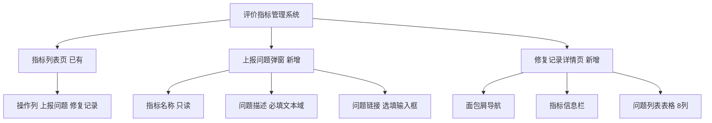
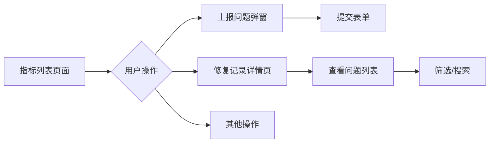

# 评价指标管理 - 问题上报与修复记录功能 PRD

## 文档信息
- 创建日期: 2025-01-24
- 文档类型: 产品规划文档
- 主要受众: 研发团队
- 项目状态: 开发阶段
- 需求优先级: P1

## 1. 背景
### 1.1 现状
仿真平台是公司内部的自动驾驶仿真测试平台，供算法团队、测试团队协同使用。评价指标管理模块用于管理和维护各种仿真评测指标（如碰撞检测、顿挫检测、变道检测等）。当前系统已支持指标列表展示、筛选搜索、准确率/召回率查看等基础功能，但缺乏问题发现后的标准化处理流程。

### 1.2 痛点
1. **上报渠道缺失**：测试人员发现指标问题后，缺乏标准化的上报渠道，只能通过IM或口头沟通
2. **状态跟踪缺失**：问题上报后缺乏跟踪机制，处理状态不透明，容易遗漏或重复处理
3. **历史追溯困难**：修复历史散落在各处（IM记录、JIRA、口头），无法统一追溯
4. **定位效率低**：问题缺乏仿真回放链接关联，开发人员难以快速复现和定位问题

## 2. 需求分析
### 2.1 用户故事
**测试/QA工程师**：在执行仿真测试发现指标异常时，希望能够快速上报问题描述和回放链接，并跟踪问题处理进度。
**算法/开发工程师**：在接收到问题后，希望能够查看问题详情，修复后填写反馈信息，让测试人员了解修复情况。

### 2.2 用户流程

### 2.3 目标
1. **一期（本周）**：实现问题上报弹窗、修复记录详情页的基础UI和交互，使用Mock数据
2. **后续（下周）**：对接后端API，实现真实数据的CRUD操作
3. **长期（Q2）**：增加问题筛选、搜索、批量操作、消息通知等增强功能

### 2.4 设计思路
| 传统方案 | 新方案 |
|----------|--------|
| IM/口头沟通 | 标准化表单上报 |
| 分散在JIRA/IM | 统一的问题记录中心 |
| 状态不透明 | 可视化状态跟踪 |
| 无回放关联 | 强制关联回放链接 |

## 3. 整体方案
### 3.1 整体结构

### 3.2 页面流程图

### 3.3 功能列表
| 序号 | 功能模块 | 优先级 | 说明 |
|------|----------|--------|------|
| 1 | 上报问题弹窗 | P1 | 模态窗口，包含指标名称、问题描述、问题链接 |
| 2 | 修复记录详情页 | P1 | 独立页面，8列表格展示问题列表 |
| 3 | 状态标签 | P1 | 待处理/修复中/已完成，带颜色区分 |
| 4 | 链接截断 | P1 | 超长链接截断显示，hover显示完整URL |
| 5 | 问题筛选 | P2 | 按状态、时间、上报人筛选 |
| 6 | 全文搜索 | P2 | 支持问题描述关键词搜索 |

## 4. 详细设计
| 序号 | 需求名 | 功能详述 | 截图 |
|------|--------|----------|------|
| 1 | 弹窗-上报问题 | 上报问题弹窗支持测试人员快速填写并提交指标问题。1.触发入口为评价指标列表操作列的上报问题按钮点击后弹出模态窗口。2.表单字段包含：a.指标名称只读字段自动带入当前指标名称如到达区域2.0；b.问题描述必填文本域最小高度8vh占位符为请输入问题描述；c.问题链接选填输入框占位符为请输入相关链接支持回放链接或JIRA链接。3.交互逻辑：a.弹窗遮罩覆盖全屏半透明黑色背景rgba0000.45；b.关闭方式包括点击遮罩点击关闭图标点击取消按钮按ESC键；c.提交校验时问题描述必填为空时提示请输入问题描述；d.提交成功后关闭弹窗并提示问题已上报。4.UI规范遵循Azure Blue主题色1677FF弹窗尺寸36vw自适应高度最小宽度480px圆角0.5vw | 图1 |
| 2 | 详情页-修复记录列表 | 修复记录详情页展示单个指标的所有问题记录支持查看和筛选。1.页面入口为评价指标列表操作列的修复记录按钮点击跳转至fixrecords.html。2.页面布局：a.复用主页面布局Header Aside Main；b.面包屑显示配置评价指标修复记录；c.顶部信息栏显示当前查看的指标名称。3.表格列设计共8列：a.问题描述18左对齐支持换行；b.回放链接14左对齐超长截断显示省略号；c.上报时间11左对齐格式YYYYMMDD HHmm；d.上报人9左对齐显示真实姓名；e.修复状态9居中对齐带颜色标签；f.修复反馈15左对齐修复人填写的反馈说明；g.修复时间11左对齐格式YYYYMMDD HHmm未完成显示；h.修复人13左对齐显示真实姓名未分配显示。4.链接截断处理设置overflowhiddentextoverflowellipsiswhitespacenowrap鼠标hover时通过title属性显示完整URL | 图2 |
| 3 | 组件-状态标签 | 状态标签使用不同颜色区分问题的处理阶段。1.待处理：a.背景色FFF1F0；b.文字色FF4D4F；c.边框色FF4D4F；d.含义为问题已上报待分配处理人。2.修复中：a.背景色FFFBE6；b.文字色FAAD14；c.边框色FAAD14；d.含义为正在修复中。3.已完成：a.背景色F6FFED；b.文字色52C41A；c.边框色52C41A；d.含义为修复完成已填写反馈 | 图3 |
| 4 | 筛选栏-问题筛选 | 问题筛选支持按多维度过滤问题列表。1.修复状态筛选：a.选项为全部待处理修复中已完成；b.交互为单选点击后实时刷新列表。2.上报时间筛选：a.选项为最近7天最近30天自定义；b.交互为选择自定义时弹出日期选择器。3.上报人筛选：a.选项为所有上报人下拉列表；b.交互为选择后实时刷新列表 | 图4 |
| 5 | 搜索栏-全文搜索 | 全文搜索支持通过关键词快速定位问题。1.触发方式为在搜索框输入关键词。2.匹配逻辑：a.搜索范围为问题描述字段；b.匹配规则为包含关系；c.实时过滤为输入后立即过滤列表。3.占位符为输入问题描述关键词搜索 | 图5 |

## 5. 后续计划
### 5.1 一期优化（下周）
优化表单交互体验和性能，包括草稿保存、快捷操作、分页加载，提升用户操作效率。

### 5.2 二期拓展（Q2）
新增问题看板视图、数据统计报表、导出功能和移动端适配，增强产品分析能力和使用场景。

### 5.3 长期规划（Q3）
引入智能问题分配、相似问题推荐和问题闭环验证，提升自动化水平和问题处理质量。

---

**文档结束**
